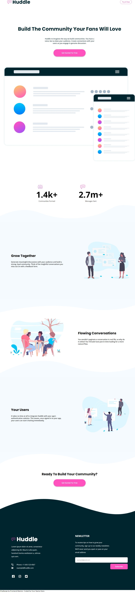
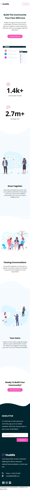

# Frontend Mentor - Huddle landing page with curved sections solution

This is a solution to the [Huddle landing page with curved sections challenge on Frontend Mentor](https://www.frontendmentor.io/challenges/huddle-landing-page-with-curved-sections-5ca5ecd01e82137ec91a50f2). Frontend Mentor challenges help you improve your coding skills by building realistic projects.

## Overview

### The challenge

Users should be able to:

- View the optimal layout for the site depending on their device's screen size
- See hover states for all interactive elements on the page

### Screenshot





### Links

- Solution URL: [Github](https://github.com/JeremyWarui/Huddle)
- Live Site URL: [Add live site URL here](https://your-live-site-url.com)

## My process

### Built with

- Semantic HTML5 markup
- CSS custom properties
- Flexbox (Alot of it)
- Mobile-first workflow

### What I learned

Learning more on flexbox tech especially for small parts that do not really require css grids

Using pseudo selectors quite awesome

```css
.footer-container {
  flex-direction: row-reverse;
  gap: 10em;
}

footer::before {
  content: url("images/bg-footer-top-mobile.svg");
  top: -50px;
}
```

## Author

- Frontend Mentor - [@JeremyWarui](https://www.frontendmentor.io/profile/JeremyWarui)

## Acknowledgments

Thanks to Frontend mentor team for this challenge.Trully sharpens your skills.
